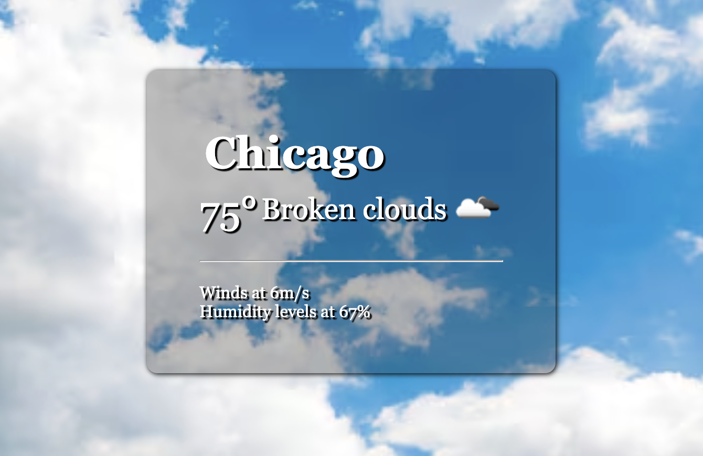

# 🌤️ Weather App

A dynamic weather dashboard built with vanilla JavaScript and the [OpenWeatherMap API](https://openweathermap.org/api) that delivers real-time weather data with **immersive, condition-driven backgrounds** — the UI shifts to match the sky.

🔗 **[Live Demo](https://anayamuzaffar.github.io/Weather-App/)**

---

## ✨ Features

- 🔍 **City or ZIP code search** — look up current weather anywhere in the world
- 🌡️ **Real-time data** — temperature (°F), wind speed, and humidity pulled live from OpenWeatherMap
- 🖼️ **Weather icons** — official condition icons rendered dynamically per result
- 🌅 **Adaptive backgrounds** — background image updates automatically based on condition:
  | Condition | Background |
  |-----------|------------|
  | ☀️ Clear skies | Bright, sunny scene |
  | ☁️ Cloudy | Overcast sky |
  | 🌧️ Rainy | Moody rain scene |
  | ⛈️ Stormy | Dark storm scene |
  | ❄️ Snowy | Winter landscape |

---

## 💻 Tech Stack

| Layer | Technology |
|-------|------------|
| Structure | HTML5 |
| Styling | CSS3 |
| Logic | Vanilla JavaScript (ES6+) |
| Data | OpenWeatherMap Current Weather API |

---

## Preview

> *Search a city → see live weather data and a matching background*

---

## Potential Future Improvements

- [ ] 5-day forecast view
- [ ] Toggle between °F and °C
- [ ] Geolocation support (auto-detect user's city)
- [ ] Country/State also displayed

---

*Built following a tutorial by [GreatStack](https://www.youtube.com/watch?v=ZPG2wGNj6J4)*